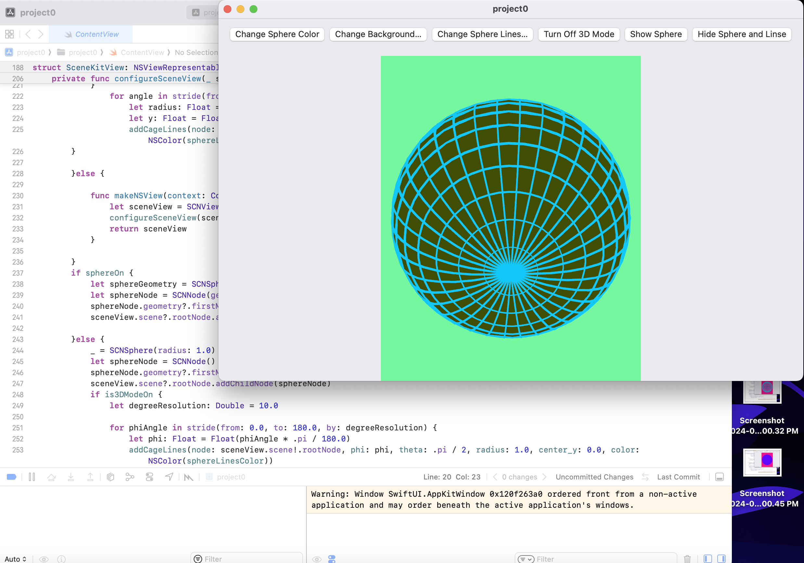
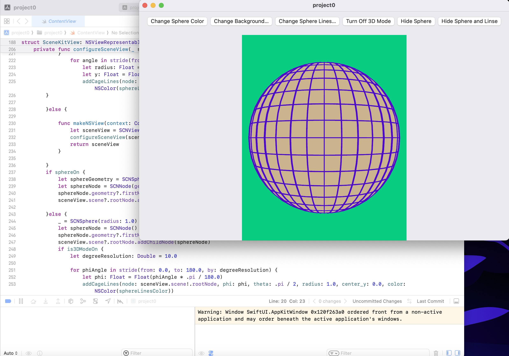
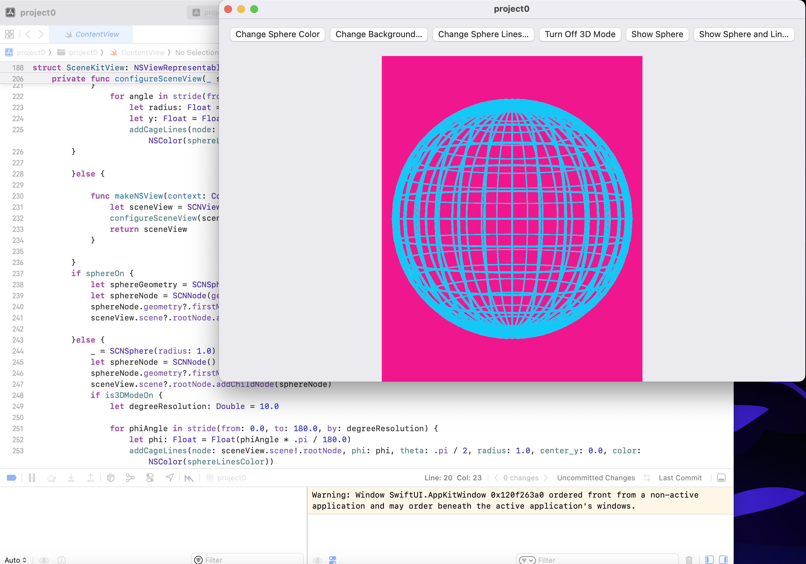
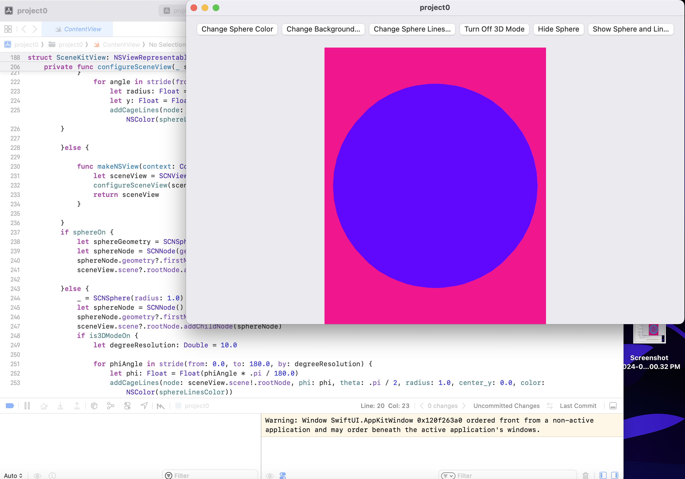

# SceneKit SwiftUI Playground

## Overview

This SwiftUI project demonstrates a 3D scene rendered using Apple's SceneKit framework. The app provides interactive controls to modify the colors of a sphere and its surrounding lines. Additionally, it offers toggles to control the visibility of both the sphere and lines, along with a switch between 2D and 3D camera modes.

## Features

- **Color Customization**: Change the colors of the sphere, background, and lines with interactive buttons.
- **Visibility Toggles**: Control the visibility of the sphere and lines.
- **2D and 3D Modes**: Switch between 2D and 3D camera controls.

## Installation

### Prerequisites

- Xcode installed on macOS.

### Steps

1. Clone the repository:
    ```bash
    git clone https://github.com/yahya-goorakani/swift.git
    ```

2. Navigate to the project directory:
    ```bash
    cd swift
    ```

3. Open the project in Xcode:
    ```bash
    open project0.xcodeproj
    ```

4. Run the project using the simulator or connect an iOS device and run the app.

## Usage

- Use the provided buttons to customize the colors.
- Toggle the visibility of the sphere and lines.
- Switch between 2D and 3D camera modes to interact with the scene differently.

## Contributing

Contributions are welcome! Feel free to fork the repository and submit pull requests.

## License

This project is licensed under the MIT License. See `LICENSE` for more details.

## Acknowledgments

- Documentation from SwiftUI and SceneKit.
- The Swift community for support and insights.

## Example







## Support

For questions or feedback, [open an issue](https://github.com/yahya-goorakani/swift/issues).

