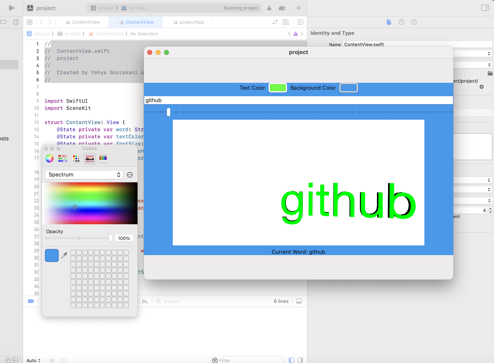
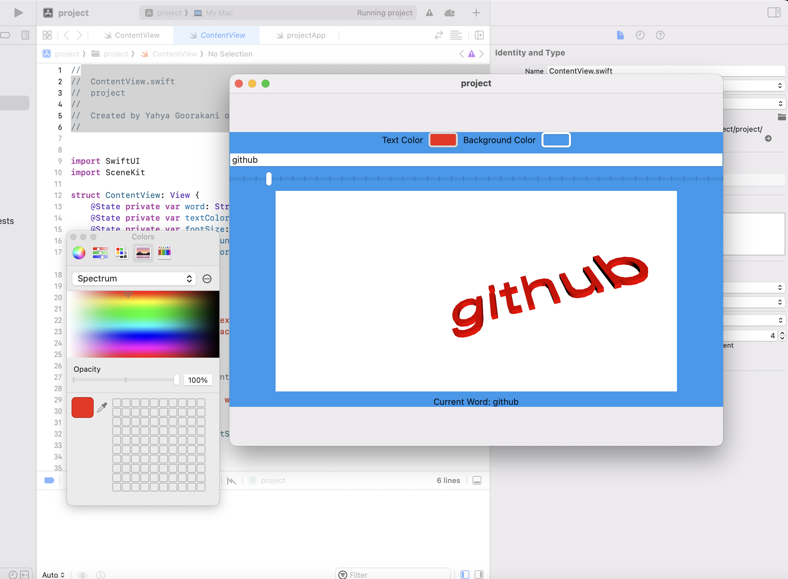
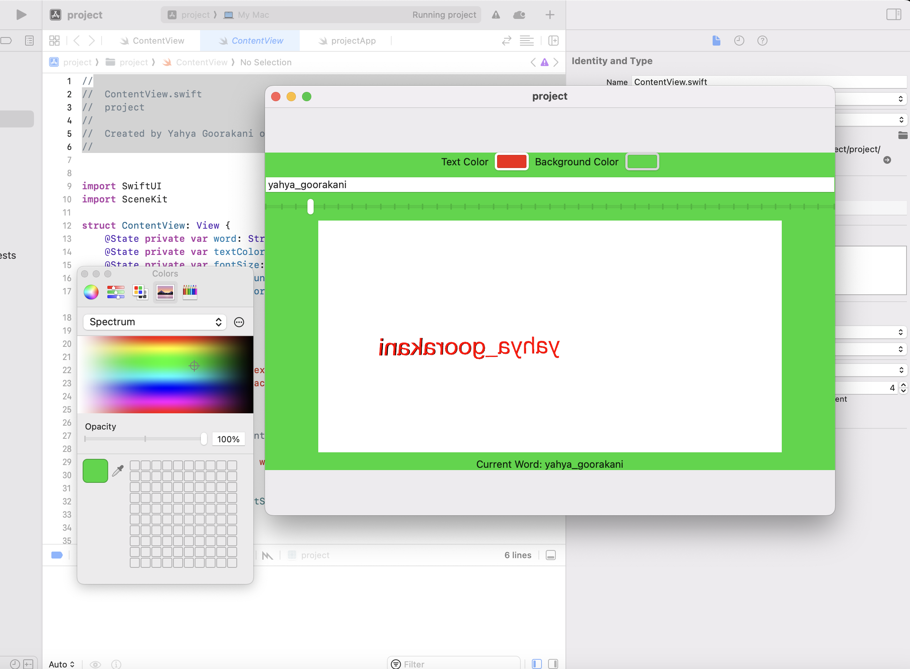

# SwiftUI and SceneKit Text Renderer

This is a straightforward SwiftUI application that utilizes SceneKit to display 3D text based on user input. Users can specify the text to be shown, pick text and background colors using color pickers, and modify the font size with a slider.

## Features
- **Text Input**: Input a word or phrase to be displayed in 3D.
- **Text Color**: Select the color of the 3D text via a color picker.
- **Background Color**: Choose the scene's background color using a color picker.
- **Font Size**: Modify the font size of the 3D text with a slider.
- **Interactive Scene**: Manipulate the 3D text using camera controls.

## Requirements
- macOS 10.15 or newer
- Xcode 12.0 or newer
- SwiftUI
- SceneKit

## Installation
1. Clone the repository or download the source code.
2. Open the project in Xcode.
3. Build and run the project on a macOS device or simulator.

## Usage
1. Launch the application.
2. Enter a word or phrase in the text field.
3. Use the color pickers and slider to adjust the text color, background color, and font size.
4. The 3D text will be rendered in the SceneKit view based on the user's input and selections.

## Code Structure
- **ContentView**: The primary SwiftUI view containing the user interface components.
  - `word`: State variable for the entered word.
  - `textColor`: State variable for the selected text color.
  - `fontSize`: State variable for the chosen font size.
  - `backgroundColor`: State variable for the selected background color.
- **SceneKitView**: An `NSViewRepresentable` struct that wraps a SceneKit `SCNView` to render the 3D text.
  - `word`: The word to display in 3D.
  - `textColor`: The color of the 3D text.
  - `fontSize`: The font size of the 3D text.

## Example

## Preview
The `ContentView_Previews` struct offers a preview of the `ContentView` within Xcode.

## License
This project is licensed under the MIT License. See `LICENSE` for more details.
